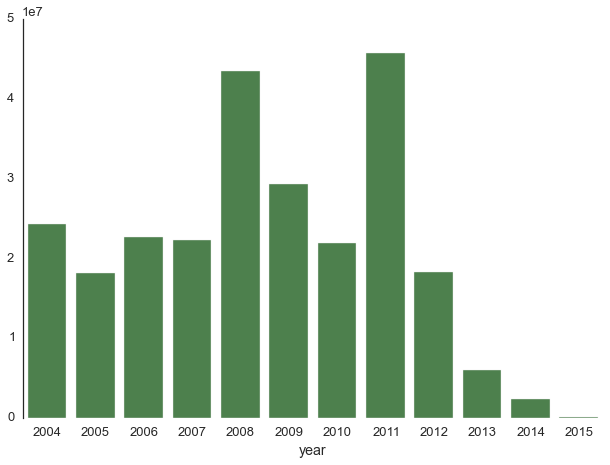

# Elections Canada donations data #

A database containing information on donations to political parties or their associations, nominees or candidates since 2006.

The database is in zip form in order to comply with GitHub's maximum file size.

The data was scraped from http://www.elections.ca/WPAPPS/WPF/EN/CCS?returntype=1 using Selenium in Python (as other scrapers had difficulties).

All of Elections Canada's [terms of service](http://www.elections.ca/content.aspx?section=pri&lang=e&document=index) have been followed; the original name of this data set is ``Financial Reports``.

Here is an example record:

    Name_of_contributor                               Adriane M S Cochrane
    Politicial_party                                  Canadian Action Party
    Contribution_given_to                             Cochrane, Gord
    Date_received                                     May 02, 2011
    Fiscal_year_or_event_date                         May 02, 2011
    Financial_report                                  Candidate's Electoral Campaign Return (2007) /...
    Class_of_contributor                              Individuals -- after December 31,2006
    Monetary                                          1000
    Non-monetary                                      0
    Contribution_given_through_name_of_association    NaN

** Currently this database is missing the following fields relating to the donor: **

* Province
* City
* Postal_Code

As this involves scraping a single web page for each of the 1,004,000 +  donors, I'm not done scraping it yet!

Caveat emptor: it appears that there's a rather long waiting period between a donation being made and Elections Canada making it available in their web search, judging from the following graph:

